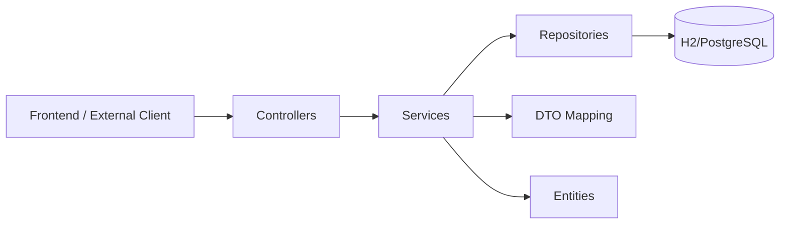

# StreetBite Backend Architecture Blueprint (Java -> C# Reimplementation Guide)

Generated: 2026-03-28T18:02:18.935Z  
Scope analyzed: `Backend\sb_api\` (Spring Boot backend)

## 1) Current Backend: What Exists Today

StreetBite backend is a **layered monolith** using Spring Boot 3.4.1 + Java 21, with this package structure:

- `controller/` REST endpoints (`/api/v1/...`)
- `service/` business logic
- `repository/` Spring Data JPA repositories
- `model/` entities + DTOs + enums
- `security/WebConfig.java` CORS policy

Technology stack from `pom.xml`:

- `spring-boot-starter-web`, `spring-boot-starter-data-jpa`
- H2 (dev runtime), PostgreSQL (runtime driver)
- Lombok
- Spring Boot test starter

## 2) High-Level Architecture (As-Is)



Characteristics:

- Clear layer separation by folder.
- Services coordinate persistence and mapping.
- Repositories are simple `JpaRepository` interfaces.
- Mostly CRUD-focused endpoints.

## 3) Domain Model & Data Relationships

Core entities:

- `Cliente` (1:N `Endereco`)
- `Comanda` (1:N `Item`, N:1 `Cliente`)
- `Item` (N:1 `Produto`, N:1 `Comanda`)
- `Produto`

Enums:

- `ComandaStatusEnum`: `PENDENTE`, `EM_PRODUCAO`, `FINALIZADO`
- `MetodoDePagamentoEnum`: `CRÉDITO`, `DÉBITO`, `DINHEIRO`, `PIX`
- `CategoriasEnum`: `ACOMPANHAMENTO`, `BEBIDA`, `COMBO`, `LANCHE`

Business behavior currently embedded in model/services:

- `Item.setProduto()` auto-sets `precoUnitario` from `Produto.preco`.
- `Item.getTotalItem()` computes line total.
- `ComandaService` computes subtotal from items.
- `StreetBiteApplication` seeds products at startup via `CommandLineRunner`.

## 4) API Surface (As-Is)

Endpoints under `/api/v1`:

- `/clientes`: POST, GET, GET by id, PATCH, DELETE
- `/enderecos`: POST, GET, GET by id, PATCH, DELETE
- `/produtos`: POST, GET, GET by id, PATCH, DELETE
- `/comandas`: POST, GET, GET by id, PATCH, DELETE
- `/comandas/item`, `/comandas/item/{id}`, `/comandas/itens`

Observations:

- Mixed usage of entities and DTOs at controller boundary.
- Update methods use PATCH but operate like full-field updates.
- Mostly `void` responses for writes; no standardized envelope/status payload.

## 5) Cross-Cutting Concerns (As-Is)

- CORS fixed to `http://127.0.0.1:5500`.
- Error handling via generic `RuntimeException` (no global exception policy).
- No explicit authentication/authorization.
- No structured validation annotations at API boundaries.
- Basic logging in `ComandaService`; no observability standards.

## 6) Key Architectural Gaps to Improve in C#

1. **Boundary consistency**: controllers should never expose persistence entities.
2. **Domain integrity**: invariants are weak and can be bypassed.
3. **Error model**: exceptions are generic; API error contract is implicit.
4. **Transaction boundaries**: not explicit for complex operations.
5. **Type consistency**: `Integer`/`Long` conversions and ID handling are noisy.
6. **Validation strategy**: scattered and mostly manual.
7. **Evolution readiness**: no clear application/domain split for scale.

## 7) Recommended Target Architecture in C# (.NET)

Use a **modular monolith with Clean Architecture boundaries**.

```mermaid
flowchart TB
    API[StreetBite.Api (ASP.NET Core)] --> APP[StreetBite.Application]
    APP --> DOMAIN[StreetBite.Domain]
    APP --> INFRA[StreetBite.Infrastructure]
    INFRA --> DB[(PostgreSQL)]
```

Project layout:

- `StreetBite.Api`
  - Controllers or Minimal APIs
  - Request/Response contracts
  - Auth, versioning, middleware
- `StreetBite.Application`
  - Use cases (commands/queries)
  - DTO mapping, validation, orchestration
  - Interfaces (repositories, services)
- `StreetBite.Domain`
  - Entities, value objects, enums, domain rules
  - Domain events (optional but recommended)
- `StreetBite.Infrastructure`
  - EF Core DbContext + repository implementations
  - External adapters, persistence config

## 8) Dependency Rules (Must Enforce)

- `Api -> Application`
- `Application -> Domain`
- `Infrastructure -> Application + Domain`
- `Domain` references nothing outside itself

No direct dependency:

- `Api -> Infrastructure` for business operations
- `Api -> Domain` entities in wire contracts

## 9) Data Architecture Guidelines (EF Core)

Entity mapping:

- Keep domain entities persistence-agnostic where possible.
- Configure relationships in `IEntityTypeConfiguration<>`.
- Use `decimal(18,2)` for prices and totals.
- Keep immutable historical values (`Item.PrecoUnitario`) to avoid retroactive price drift.

Recommended aggregates:

- Aggregate root: `Comanda`
  - owns `Item` collection
  - status transitions validated in domain methods
- Aggregate root: `Cliente`
  - owns address list (`Endereco`)

ID strategy:

- Prefer `Guid` or `long` consistently; avoid mixed numeric conversions.

## 10) API Design Standards

- Keep Portuguese domain naming if business language requires it, but standardize style.
- Use versioned routes: `/api/v1/...`.
- Return typed responses for all write operations (`201/200` + payload).
- Adopt ProblemDetails (`RFC 7807`) for errors.
- Separate request and response DTOs.
- Add pagination/sorting for list endpoints.

## 11) Validation, Errors, and Resilience

Validation:

- FluentValidation for request models.
- Domain validation inside aggregate methods for invariants.

Error handling:

- Global exception middleware mapping:
  - `DomainException` -> `400`
  - `NotFoundException` -> `404`
  - `ConflictException` -> `409`
  - unexpected -> `500` with correlation ID

Transactions:

- One use case = one transaction boundary (command handlers).
- Use optimistic concurrency token (`rowversion`) for updates.

## 12) Security & Configuration

- Add authentication (JWT bearer) and role/claim-based authorization.
- Keep CORS per environment config (`appsettings.*.json`), not hardcoded.
- Store secrets outside source control (User Secrets / Key Vault / env vars).

## 13) Observability & Operations

- Structured logging with Serilog.
- Correlation IDs per request.
- Health checks (`/health/live`, `/health/ready`).
- OpenTelemetry for traces/metrics (future-ready).

## 14) Testing Architecture

Required test layers:

- Domain unit tests (pure business rules)
- Application tests (use case orchestration with fakes/mocks)
- Integration tests (EF Core + PostgreSQL test container)
- API tests (contract + status codes + validation)

Current Java baseline has only minimal context-load testing, so treat tests as a major upgrade area.

## 15) Migration Blueprint: Java -> C#

1. Model the domain first (`Comanda`, `Item`, `Produto`, `Cliente`, `Endereco`, enums).
2. Implement use cases:
   - Criar comanda
   - Adicionar item na comanda
   - Atualizar status
   - CRUD de produtos/clientes/enderecos
3. Implement persistence with EF Core mappings.
4. Expose API contracts and controllers/endpoints.
5. Add validation + exception middleware + ProblemDetails.
6. Add authentication/authorization.
7. Add comprehensive tests.

## 16) Implementation Templates (Concise)

Application command:

```csharp
public sealed record CriarComandaCommand() : IRequest<ComandaDto>;
```

Repository contract:

```csharp
public interface IComandaRepository
{
    Task<Comanda?> GetByIdAsync(long id, CancellationToken ct);
    Task AddAsync(Comanda comanda, CancellationToken ct);
    Task SaveChangesAsync(CancellationToken ct);
}
```

Domain method style:

```csharp
public void AdicionarItem(Produto produto, int quantidade)
{
    if (quantidade <= 0) throw new DomainException("Quantidade inválida.");
    _itens.Add(Item.Criar(produto.Id, produto.Nome, produto.Categoria, quantidade, produto.Preco));
    RecalcularSubtotal();
}
```

## 17) ADRs (Architectural Decision Records) to Create

Create these ADRs early:

- ADR-001: Adopt Clean Architecture modular monolith
- ADR-002: EF Core + PostgreSQL as persistence standard
- ADR-003: MediatR (or equivalent) for use-case orchestration
- ADR-004: ProblemDetails + global exception strategy
- ADR-005: JWT auth and authorization model

## 18) Common Pitfalls to Avoid in Reimplementation

- Exposing EF entities directly in API contracts.
- Putting business rules in controllers.
- Recomputing historical item prices from current product price.
- Generic exception throwing without domain semantics.
- Hardcoded config (CORS, connection strings, secrets).
- Weak test coverage for status transitions and subtotal rules.

## 19) Governance Checklist for New Features

For every new feature, confirm:

- Uses an Application use case (not controller logic)
- Enforces domain invariants in Domain layer
- Uses DTO contracts only at API boundary
- Has validation + deterministic error mapping
- Has unit + integration tests
- Adds logs and, when relevant, metrics/traces

---

If you want, next step I can generate the **actual C# solution skeleton** (`Api`, `Application`, `Domain`, `Infrastructure`) with folder structure and starter code for `Comanda` flow.
