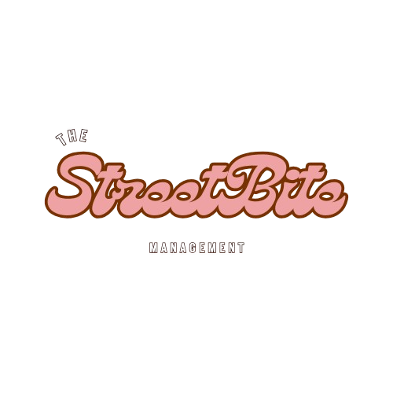

# StreetBite

<div align="center">
  

  <h1>StreetBite</h1>
  <p>Plataforma web para gestão de food trucks, com cardápio, comandas e pedidos em um único fluxo.</p>

  <p>
    
    
    
    
  </p>
</div>

## Sobre o projeto

O StreetBite foi criado para profissionalizar operações de food trucks com uma interface enxuta e de baixo custo. A ideia é reduzir o trabalho manual, diminuir erros de registro e centralizar em uma só aplicação o controle de cardápio e pedidos.

## Visão geral da arquitetura

| Camada       | Responsabilidade                                                        |
| ------------ | ----------------------------------------------------------------------- |
| **API**      | Expõe os endpoints REST, valida requisições e aplica regras de negócio. |
| **Core**     | Contém entidades, enums, validações e modelos de resultado.             |
| **Infra**    | Faz a persistência com EF Core e PostgreSQL.                            |
| **FrontEnd** | Entrega a interface web em HTML, CSS e JavaScript puro.                 |

```text
FrontEnd (Vanilla JS)
        ↓ HTTP
.NET 10 API (Minimal APIs)
        ↓ EF Core
PostgreSQL
```

Veja os detalhes técnicos em:

- [README da API](./Api/README.md)
- [README do FrontEnd](./FrontEnd/README.md)
- [Guia de setup e Docker](./DOCKER-SETUP.md)
- [Notas de arquitetura](./AGENTS.md)

## Estrutura do repositório

```text
StreetBite/
├── Api/        # Backend .NET 10
├── FrontEnd/   # Interface web estática
├── compose.yaml
├── AGENTS.md
└── README.md
```

## Como executar

### Com Docker

```bash
docker compose up --build
```

### Localmente

Backend:

```bash
cd Api
dotnet build src/StreetBite.Api/StreetBite.Api.csproj
dotnet run --project src/StreetBite.Api/StreetBite.Api.csproj
```

FrontEnd:

```bash
cd FrontEnd
npm install
npm run dev
```

## Capturas de tela


## Figma

- [Design da aplicação](https://www.figma.com/design/uAC8odd4ScmFf9QTPhL8t1/StreetBite?node-id=0-1&p=f&t=Hr3nVETTd1u2AIGM-0)

## Integrantes

- Salis Silva
- José Lucas
- Pedro Correia
- Pedro Leão
- Julia Cavalcante

## Instituição

CESMAC AL — Sistemas de Informação

## Status

Projeto acadêmico em evolução.
